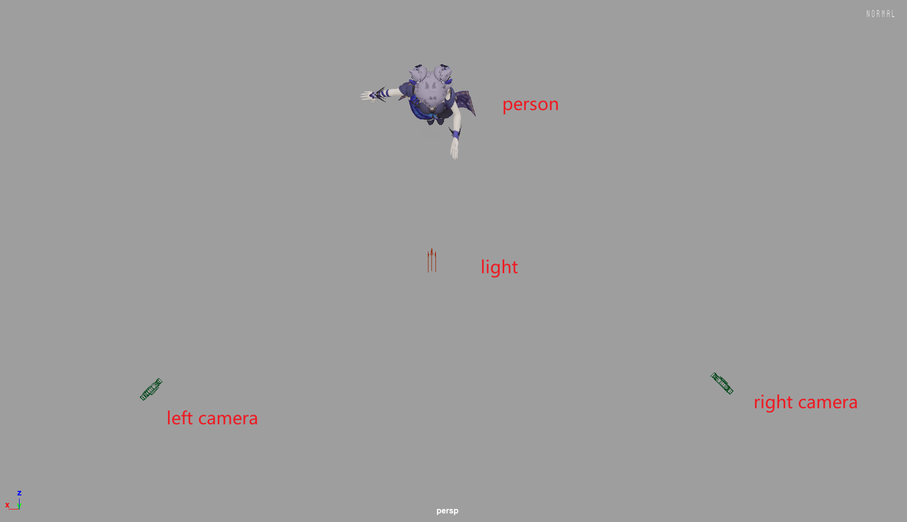
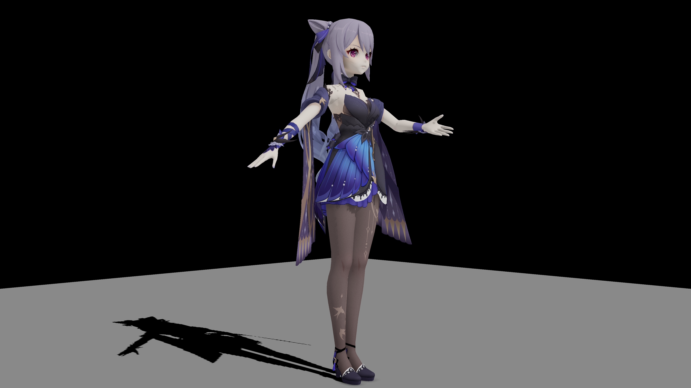
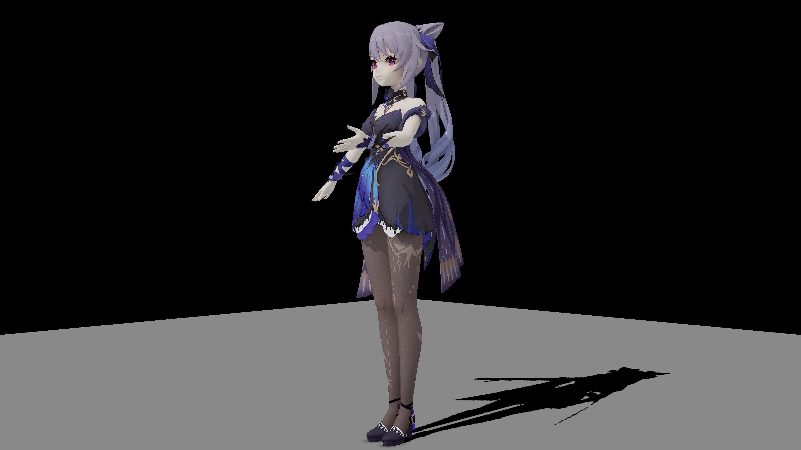

# Openpose-Motion-Rebuild

中文(Simplified Chinese) | [English - todo](./README_EN.md)

本项目通过[openpose](https://github.com/CMU-Perceptual-Computing-Lab/openpose)，输入两张焦平面非平行的同一个人体姿态照片，即可对姿态的三维图片进行重建。

## 使用

> **需要的第三方库:**  
> numpy  
> python-opencv  
> matplotlib  
> **关于openpose:**  
> 请自行clone原项目，并编译带python api的二进制文件  
> 编译后请在[importop.py](./importop.py)中修改目录

使用例见[main.py](./main.py)

## 原理

本质上是通过一个视角获取到的关于另一个视角的第三轴信息，并结合两视角间夹角进行三角函数计算以还原第三轴信息。

理论上在两视角夹角(also,焦平面)接近Π/2时，重建而得的第三轴信息较为精准。

## 演示图片

**识别结果**

**第一视角**

**第二视角**

